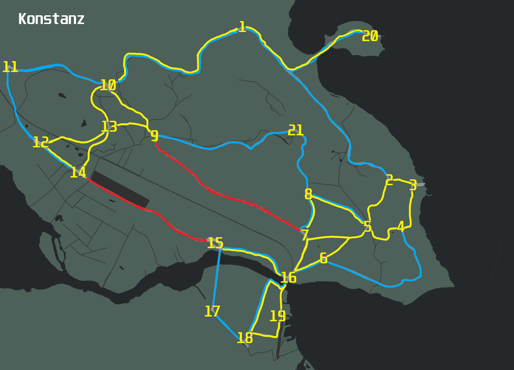

 Scotland Yard
=====================================================

## Digital version of the classic board game
Scotland Yard is a board game in which a team of players controlling different detectives cooperate to track down a 
player controlling a criminal as they move around a board representing the streets of London. It was first published
in 1983. It is named after Scotland Yard - the headquarters of London's Metropolitan Police Service in real-life. 
Scotland Yard is an asymmetric board game, during which the detective players cooperatively solve a variant of the 
pursuit-evasion problem.

### Object of the game
There is one player that is called *Mister X*. He needs to stay undercover to escape from his pursuers. 
The other players are *Detectives* and their goal is to catch *Mister X*. 
The number of moves are limited.

## Custom map of german city Konstanz

### Rules
*  There are 4 different travel options. Taxi, Bus, Underground and black tickets, which only *Mr. X* can use.
*  At the beginning of the game, a specific amount of tickets is assigned to each player.
*  Then each player gets assigned to a starting position.
*  Finally *Mister X* begins. He writes the point, he travels to, in the travel log. Then he covers it up with the appropriate ticket.
*  The *Detectives* need to anticipate the location of *Mister X* and catch him by traveling to the point he stands at.
*  The position of *Mister X* is only revealed after a specific amount of rounds.
